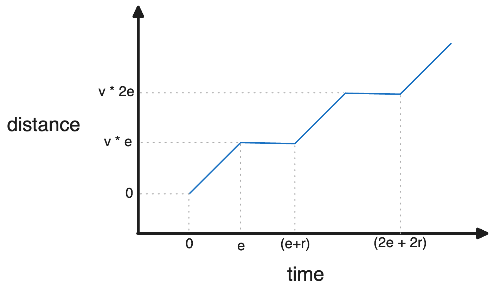

# 14

To install dependencies:

```bash
bun install
```

To run:

```bash
bun run index.ts
```

This project was created using `bun init` in bun v1.0.20. [Bun](https://bun.sh) is a fast all-in-one JavaScript runtime.

## Solution

The crux of this problem is determining how far a Reinder has run after $t$ seconds.

Each Reindeer can be modeled with a velocity ($v$) indicating a speed the deer can run for a certain duration of seconds based on their endurance ($e$) before needing to rest for $r$ seconds. 



The graph above shows the distance over time for an arbitrary Reindeer running.

We can calculate the function $D(t)$ by first calculating the number of sprints ($n_t$) the reindeer has completed in $t$ seconds - where a sprint encapsulates the full cycle of running and resting as measured by ($e+r$)
$$
n_t = \lfloor \frac{t}{e + r} \rfloor
$$

We can then determine how many seconds into the current sprint we've traveled.

$$s = t - n_t(e + r)$$

We can use the standard distance formula for constant velocity 

$$ D(T) = vT $$

if we're able to determine the total number of seconds the reindeer has spent running run ($T$) (removing the time spent resting)

$$T = en_t + \min\{e, s\}$$

putting it all together..
$$
D(t) = v(en_t + \min\{e, s\})
$$